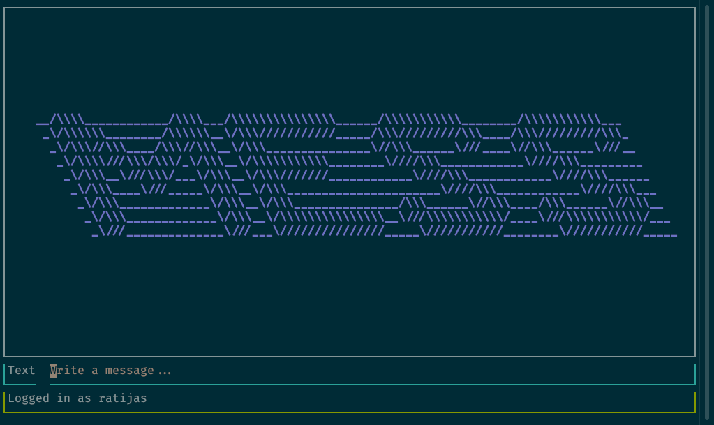
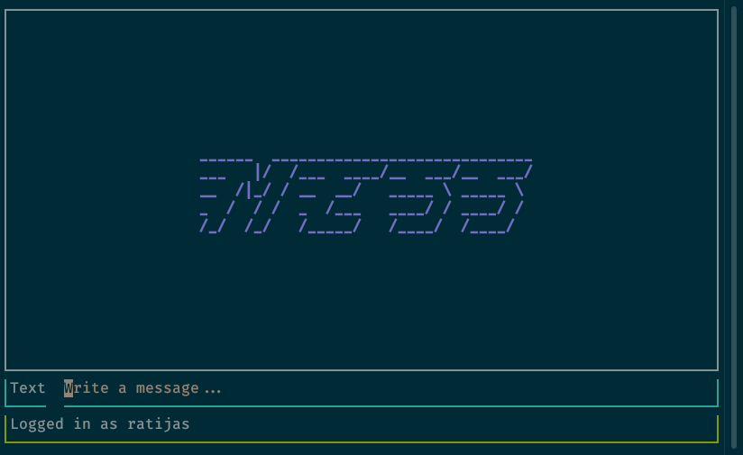
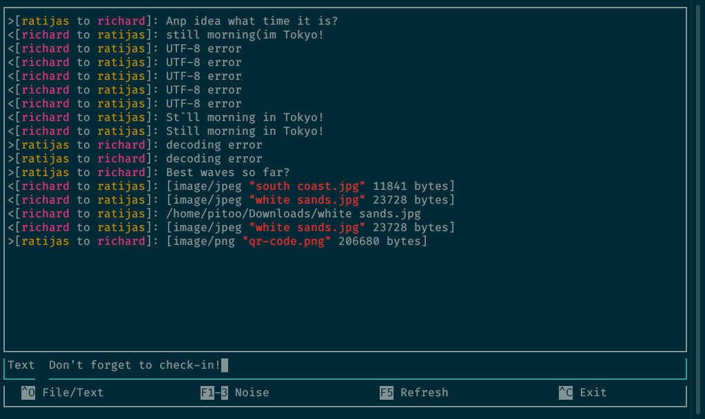
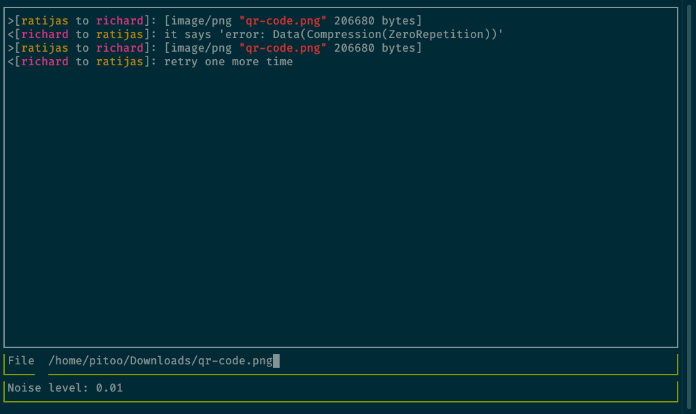

# MESS — experimental messenger



experimental messenger written for university course on information theory.

key features:

 - compression / decompression algorithms
 - encoding / decoding algorithms
 - add customizable noise to the message
 - exchange text and files
 - client/server architecture
 - simple JSON REST RPC
 - cool terminal user interface for client
 - written in rust programming language — extremely fast in `--release` mode.

encoding / decoding helps fighting noise, while compression / decompression attempts to reduce bandwidth.

available encodings:

 * [hamming(7,4)-code](https://en.wikipedia.org/wiki/Hamming%287%2C4%29)
 * [repetition](https://en.wikipedia.org/wiki/Repetition_code): 3 &amp; 5
 * [parity-check code](https://en.wikipedia.org/wiki/Parity_check): 1 check bit per 4 bits of data

available compressions:

 * RLE ([Run Length Encoding](https://en.wikipedia.org/wiki/Run-length_encoding))
 * [Huffman coding](https://en.wikipedia.org/wiki/Huffman_coding)
 * [Shannon–Fano coding](https://en.wikipedia.org/wiki/Shannon%E2%80%93Fano_coding)

# Run



first, start server.  server is very quiet, so don't expect it to print anything.

`$ cargo run --package mess-server`

then, start two clients from different terminals.

```
$ cargo run --package mess-client -- jack mary
$ cargo run --package mess-client -- mary jack
```

only local connections are supported at the moment due to the lack of address/port options switches.  as usual, ssh tunnels may be used.

client receives from anyone, but writes only to one user at a time.  to switch users, just restart client with different usernames.

# Client hotkeys

 - `F1`-`F3` switches between noise levels. `F4` disables noise.
 - `F5` — clear history
 - `Ctrl-C` — exit
 - `Ctrl-L` — redraw
 - `Ctrl-O` — switch text/file modes
 - `Up` arrow — insert copy of last text message into the input field.

# Screenshots




